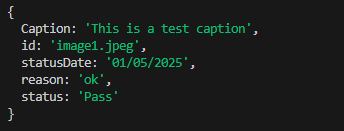
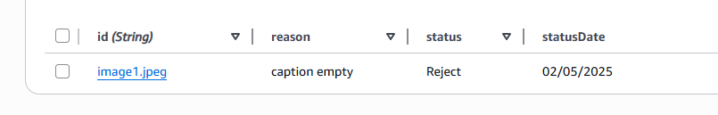
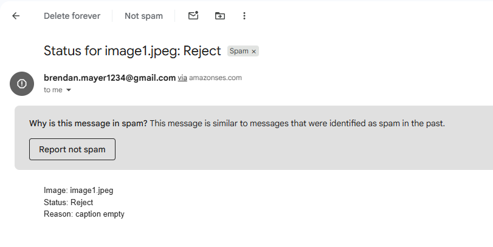

# ds-assignment-2

### Commit - 1
I set up a cdk project and added an S3 bucket for photos, a DynamoDB table for images

### Commit - 2
I created an SQS queue with a DLQ, and hooked up S3 events to the queue.

### Commit - 3
I created the Log Image Lambda that reads from the queue, checks file types, and stores valid images in DynamoDB. Invalid files go to the DLQ.

### Commit - 4
I added the Remove Image Lambda that listens to the DLQ and deletes invalid files from S3. I tested this by uploading a .txt file

### Commit - 5
I made an SNS topic and the Add Metadata Lambda. It updates DynamoDB items with caption, date, and photographer name. Added filter so only metadata messages go here.

### Commit - 6
I built the Update Status Lambda for moderators. It updates the DynamoDB item with Pass or Reject decisions and reason. Added filter so only status messages go here.

### Commit - 7
I made the Confirmation Mailer Lambda using SES. It sends an email to the photographer when the moderator updates a photo’s status.

### Commit - 8
I added CLI JSON files for metadata and moderator messages and tested message filtering through SNS.

## features
- photographer log new images: s3->sqs->lambda writes to dynamodb
- metadata updating: sns topic with add-metadata lambda
- invalid image removal: dlq polled by remove-image lambda deletes from bucket
- moderator status updating: sns to update-status lambda writes status and reason
- status update mailer: confirmation-mailer via ses
- filtering: single topic with subscription filters so metadata messages do not reach status or mailer subscribers
- messaging: sns for app messages, sqs for uploads
