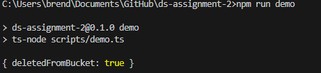
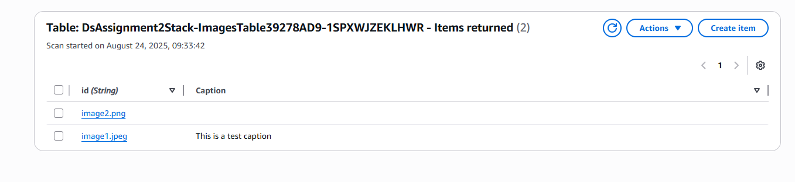

# ds-assignment-2

### Commit - 1
I set up a cdk project and added an S3 bucket for photos, a DynamoDB table for images

### Commit - 2
I created an SQS queue with a DLQ, and hooked up S3 events to the queue.

### Commit - 3
I created the Log Image Lambda that reads from the queue, checks file types, and stores valid images in DynamoDB. Invalid files go to the DLQ.

### Commit - 4
I added the Remove Image Lambda that listens to the DLQ and deletes invalid files from S3. I tested this by uploading a .txt file

### Commit - 5
I made an SNS topic and the Add Metadata Lambda. It updates DynamoDB items with caption, date, and photographer name. Added filter so only metadata messages go here.
